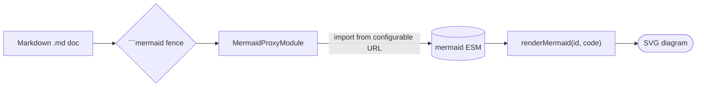
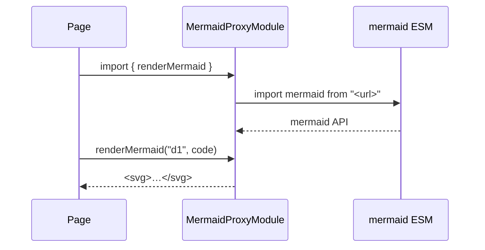

# Mermaid — Demo

A quick demo doc containing a [Mermaid](https://mermaid.js.org/) diagram. Mermaid lets you
author diagrams as text — the source lives right in the markdown, in a fenced
` ```mermaid ` block.

## A flowchart



## A sequence diagram



## How the diagram gets rendered

The `MermaidProxyModule` (in the framework's `homing-libs`) is a **configurable 3rd-party
proxy**: it imports the real Mermaid ESM from a default CDN URL and re-exports a small
`renderMermaid(id, code) → svg` helper. The doc-reader's markdown renderer wires this in —
after marked.js parses the page it finds each ` ```mermaid ` fence and, **only when a diagram
is actually present**, lazily imports the same-origin proxy and swaps the fence for the
rendered SVG. Diagram-free docs never load Mermaid at all. (The two diagrams above are the
live output of that hook.)

## Connectivity & enterprise networks

The proxy imports Mermaid **at runtime** from a remote URL:

```js
import mermaidLib from "https://cdn.jsdelivr.net/npm/mermaid@11/dist/mermaid.esm.min.mjs";
```

so the browser must be able to reach it. Behind a restrictive corporate proxy (e.g. ZScaler)
or on a network with no outbound connectivity, that fetch can fail — a blocked domain,
CORS headers stripped by TLS interception, a block page served with the wrong MIME type, or
an untrusted interception certificate. When it does, the page **degrades gracefully**: the
code fence is kept and a short note is shown instead of a broken diagram.

The fix is to point the proxy at a reachable copy — a **dedicated / internal CDN mirror** —
via the override, once at boot:

```java
ExternalModuleUrlRegistry.INSTANCE.override(
        MermaidProxyModule.class,
        "https://mirror.internal/mermaid@11/mermaid.esm.min.mjs");
```

Standing up that mirror is a deployment concern, not a framework one — any static host or
off-the-shelf CDN/mirroring tool serves it; just return `mermaid.esm.min.mjs` with a
JavaScript MIME type. Prefer a **pre-bundled single-file** build (e.g.
`https://esm.sh/mermaid@11?bundle`) so Mermaid's lazily-imported diagram chunks resolve
without extra cross-origin round-trips.

> A server-side "fetch-from-CDN, re-serve-locally" proxy was considered, but it doesn't help
> a server that itself has no external connectivity (it only relocates the egress). Pointing
> the override at a reachable mirror is the simpler, sufficient answer. For a fully
> air-gapped deployment, bundle Mermaid at build time instead (the `BundledExternalModule`
> pattern used by Tone.js / Three.js).
