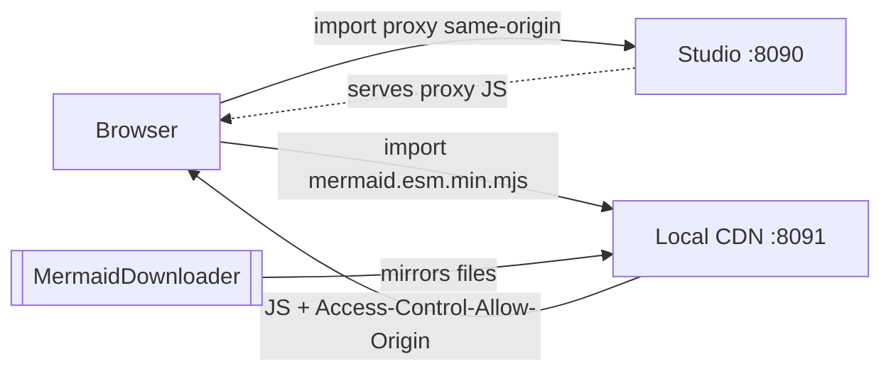

# Mermaid via Local CDN

This diagram is rendered by Mermaid **served from the local CDN on port 8091**, not from the
public jsDelivr CDN. This studio (port 8090) overrides the proxy URL at boot:

```java
ExternalModuleUrlRegistry.INSTANCE.override(
        MermaidProxyModule.class,
        "http://localhost:8091/mermaid.esm.min.mjs");
```

So the browser imports the same-origin proxy, the proxy imports Mermaid from **your** CDN,
and that CDN answers with the CORS headers a cross-origin ES-module import requires.



If the diagram above rendered as a picture, the whole loop works: the download util mirrored
Mermaid into `./mirror/`, the local CDN served it with CORS, and the studio's override pointed
the proxy at it. If it shows as a note instead, the CDN couldn't serve the files — see the
module's `README.md` for the run order and a manual-download fallback.
